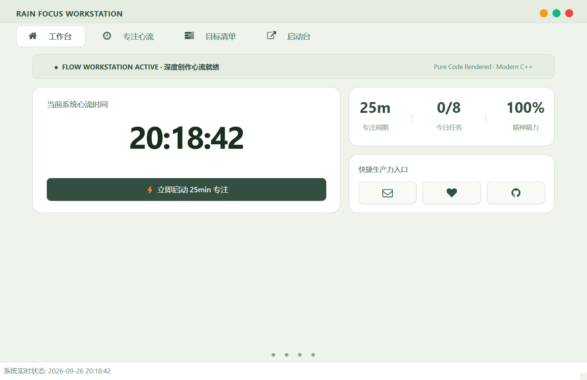
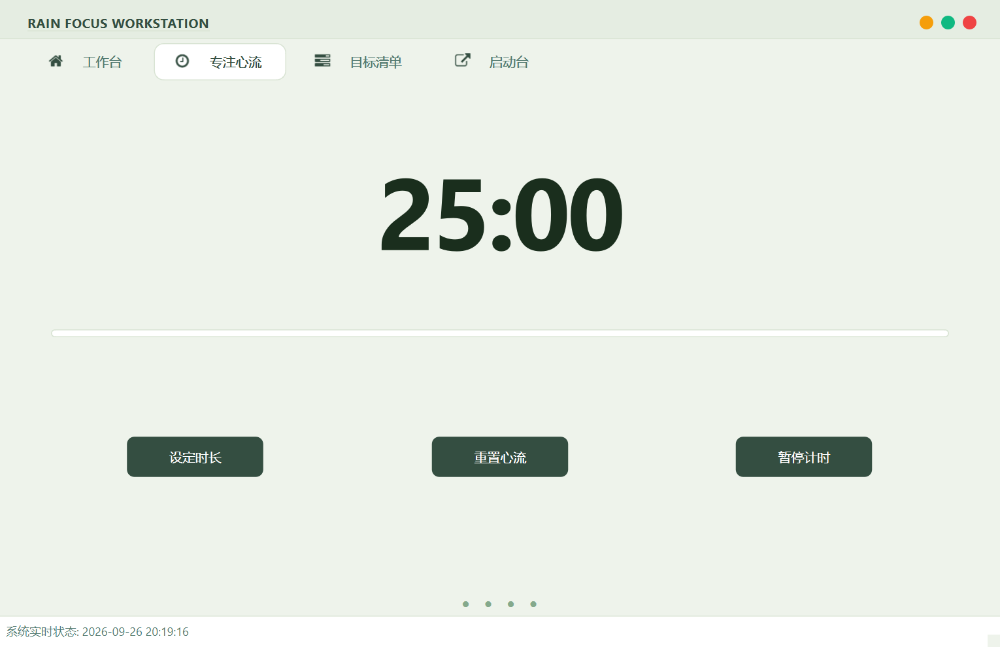
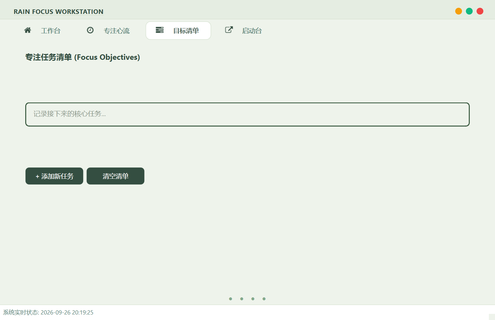
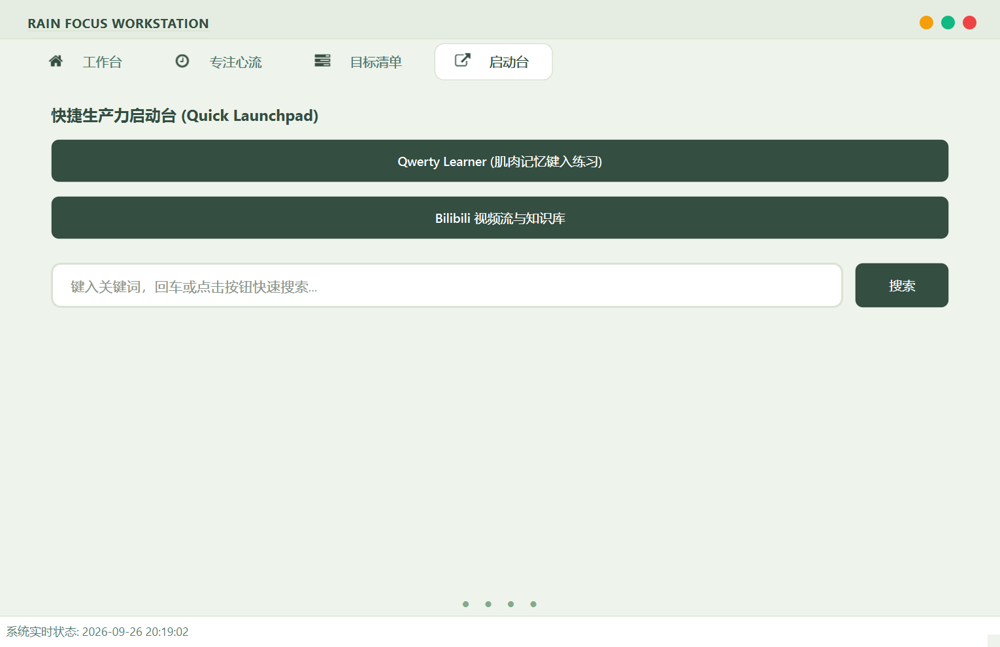

# 🌿 RAIN Focus Workstation

<p align="center">
  <strong>基于 Qt 6 & 现代 C++ 打造的 Bento Grid（便当网格）沉浸式专注心流工作台</strong>
</p>

<p align="center">
  
  
  
  
  
</p>

---

## 📖 项目简介 (Overview)

**RAIN Focus Workstation** 是一款去油腻、极简现代的桌面端个人心流与生产力管理套件。

项目抛弃了传统工具粗糙的厚边框与刺眼的高对比度渐变，汲取了目前流行的 **Bento Grid（便当网格）** 与 **卡片微描边** 交互美学，通过 **全矢量纯代码渲染（0 图片依赖）**、**自适应动态字阶** 和 **5 款精选莫兰迪主题调色盘**，为开发者、创作者及深度工作者提供纯净、无打扰的心流体验。

---
## 界面与效果预览

| 界面1|界面2| 界面3 |
| :---: | :---: | :---: |
|  |  |  |

## ✨ 核心亮点 (Highlights)

- **🍱 现代化 Bento Grid 布局**：信息密度恰到好处的模块化卡片设计，主页集成「当前心流时间」、「三联指标矩阵」与「快捷工具坞」。
- **🎨 纯代码矢量光栅化（0 PNG 资源）**：
  - 核心图标全部依托内存中 `QPainter` 抓取 `FontAwesome` 矢量字形动态合成；
  - 交通灯三色控制点采用纯 QSS 圆角渲染，彻底告别位图模糊与边缘裁切。
- **🌓 5 种精选调色盘动态换肤**：
  - 包含 **清爽米绿**、**优雅薰衣草**、**冰川静蓝**、**夏日草甸** 与 **极客暗黑**；
  - 右键二级菜单随时即时切色，支持 `Q + A` 键盘一键循环轮转，所有矢量图标跟随主题色动态重绘。
- **⏱️ 专注状态显著字号突增**：
  - 闲置准备时保持 `52px` 柔和预览字号；
  - 点击「开启心流」瞬间，倒计时字体立即膨胀至 **`110px 醒目超大字阶`**，带来极具张力的大屏全神贯注体验。
- **🪟 工业级 28px 基准线对齐**：
  - 窗口标题、导航 Tab 栏、认证标头及主卡片在左侧严格遵循 `28px` 垂直对齐规范，告别错位卡顿感。
- **🔍 响应式舒适搜索栏**：
  - 单行 `QLineEdit` 纯净居中排版（46px 高度），彻底消灭多行编辑器的文字截断与滚动条滑块，支持回车键一键直达搜索。

---

## 🧩 核心功能模块 (Features)

| 模块名称 | 图标 | 功能说明 |
| :--- | :---: | :--- |
| **工作台 (Home)** | `icon_home` | 核心时间看板、实时年月日星期提醒、25m/0-8/100% 状态概览矩阵、外部反馈及仓库一键直达 |
| **专注心流 (Focus)** | `icon_time` | 自定义番茄钟倒计时（1~300 分钟）、110px 显著醒目大字阶、微细进度条、暂停/继续/重置流转 |
| **目标清单 (Tasks)** | `icon_tasks` | 约束型每日 8 项核心任务管理、彩色微卡片输入框、支持独立增加与安全批量清空 |
| **启动台 (Resources)** | `icon_external_link` | 常用知识库外链跳转、居中舒适搜索栏（支持 Enter 回车直接拉起系统浏览器检索） |

---

## 🎨 调色盘规范 (Theme Palettes)

系统采用 **设计令牌（Design Tokens）** 架构，将色彩完全解耦，支持以下 5 套主题：

1.  🌿 清爽米绿 (Light Sage) - 护眼淡绿底色 (#eef3eb) + 森林墨绿 (#344e41)
2.  🪻 优雅薰衣草 (Lavender) - 柔美灰紫底色 (#f5f3f8) + 莫兰迪紫 (#6b3ba7)
3.  🌊 冰川静蓝 (Nordic Blue) - 冰川冷灰蓝底 (#edf4f8) + 深邃海洋蓝 (#026896)
4.  🌻 夏日草甸 (Summer Meadow) - 暖调奶白底色 (#faf7ee) + 草绿 (#467a57) + 暖阳橙 (#f28e00)
5.  🌙 极客暗黑 (Dark Slate) - 曜石暗黑底色 (#0f172a) + 荧光天蓝 (#38bdf8)


---

## ⌨️ 快捷键与交互操作 (Shortcuts & Gestures)

| 操作 | 交互响应 |
| :--- | :--- |
| **按下 `Q + A`** | 依次在 5 套调色盘主题之间即时平滑轮转 |
| **鼠标右键单击** | 唤起现代右键上下文菜单（调色盘子菜单、专注模式、还原尺寸、关于） |
| **双击顶部标题栏** | 在「最大化」与「黄金初始比例 (1020 × 660)」之间切换 |
| **在搜索栏按回车** | 直接拉起浏览器发起百度检索 |
| **按住标题栏拖动** | 自由平滑拖动移动无边框窗口 |

---

## 🛠️ 技术栈与依赖 (Tech Stack)

* **语言标准**：C++17 / C++20
* **GUI 框架**：Qt 6.6.3 (兼容 Qt 6.2+ LTS)
* **编译器**：MSVC 2019 / 2022 (x64)
* **矢量图标**：FontAwesome 4.7 字体光栅化引擎
* **架构设计**：面向对象设计、设计令牌 (Design Tokens)、RAII 内存管理、事件过滤器 (Event Filter)

---

## 📂 项目文件结构 (Project Structure)

```text
RAIN_Focus/
│
├── Qt_focus.h              # 核心主窗口头文件（前置声明、组件生命周期管理）
├── Qt_focus.cpp            # 主窗口逻辑实现（Bento 网格构建、计时器、矢量绘制引擎）
├── style.h                 # 集中式主题样式类（5 套调色盘 Tokens 与 QSS 模板构建器）
├── fontawesomeicons.h      # FontAwesome 矢量字符枚举定义
├── fontawesomeicons.cpp    # 矢量字体加载单例实现
├── my_button_class.h       # 自定义增强型按钮扩展
├── roundprogressbar.h      # 圆形环状进度条扩展组件
├── tabhover.h              # Tab 底部悬浮小圆点指示器组件
├── main.cpp                # 应用程序入口
│
└── Resources/              # Qt 资源文件目录 (*.qrc)
    └── fontawesome-webfont.ttf  # 字体矢量文件

🚀 构建与运行 (Build & Run)

方式一：使用 Visual Studio (推荐)

1.  确保安装了 Visual Studio 2022 及 Qt Visual Studio Tools 插件；
2.  确认本地已配置 Qt 6.6+ (msvc2019_64 或 msvc2022_64)；
3.  双击打开 Qt_focus.sln 解决方案；
4.  选择编译平台为 Release | x64；
5.  按下 Ctrl + Shift + B 构建解决方案，生成成功后按 F5 启动。

方式二：使用 CMake

# 1. 克隆本仓库
git clone https://github.com/XiaoYu-1111/Qt_focus.git
cd Qt_focus

# 2. 创建并进入构建目录
mkdir build && cd build

# 3. 运行 cmake 生成构建脚本 (指定你的 Qt6 安装路径)
cmake .. -DCMAKE_PREFIX_PATH="D:/Qt/6.6.3/msvc2019_64"

# 4. 执行编译
cmake --build . --config Release

📝 贡献与致谢 (Credits)

  - 开发者：RAIN (XIAOYU)
  - 开源协议：本项目基于 MIT License 开源。
  - 关于与支持：欢迎提交 Issue 或 Pull Request，一起让沉浸式生产力工具更加优雅！

